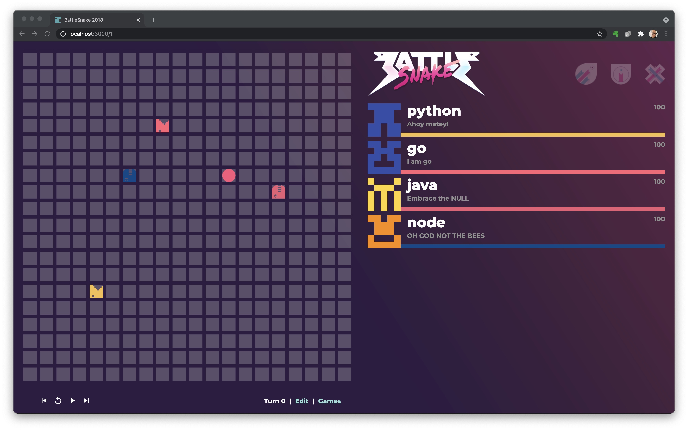
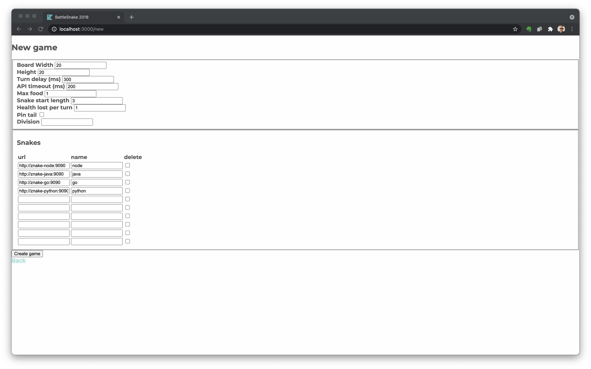

# znake-arena

A Battlesnake playground for Zuhlke's 2021 summer camp.

## API Backend

See https://github.com/conflictserpent/battlesnake-server-2018

## GamePlay



## Local Development of your Snake

### Manual Configuration

```shell
# 1) run the battlesnake-server on localhost:3000
make run-battlesnake-server

# 2) Start your Snake on your local machine on a port (e.g.: 7070)

# 3) Create a new game in the UI
open http://localhost:3000/new

# 4) Enter your snakes url: http://host.docker.internal:7070 
```

### Scripted

```shell
# 1) run the battlesnake-server on localhost:5000
make run-battlesnake-server

# 2) Add your Snake's name and url to a text file 
# dev-snake,http://host.docker.internal:9090

# 3) Run the script
cd scripts && make new-game CONFIG=starter.snakes.txt
```

### New Game Dialog


